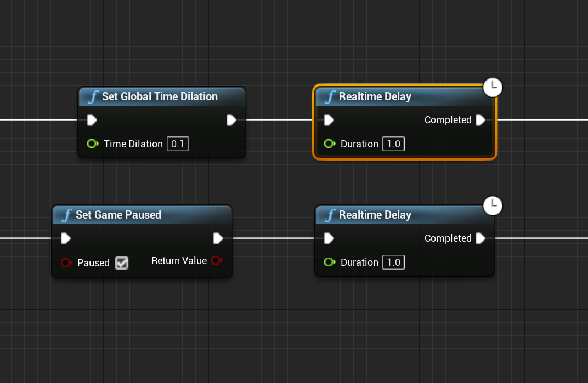

# ue4-realtime-delay
* Unreal Engine 4/5でGlobal Time DilationやGame Pauseの影響を受けずにDelayを実行するプラグインです
* Delayノードで実際に待つ秒数はGlobal Time Dilationの設定に依存して時間が伸びたり、Game Pause中は無限に待ってしまうなど、使いどころが難しい場面もあります
* そういった場合に、このプラグインの提供するRealtime Delayノードを使えば、指定したDuration通りにDelayが行われます

## 仕様

* Global Time DilationやGame Pauseの影響を受けずにDelayを実行できる「Realtime Delay」ノードを提供します

## 動作環境

* UE4.26.x
* UE5.2.x

基本的な機能しか使っていないので、大体のUE4/5のバージョンで動くと思います。稼働報告をくれると嬉しいです。

## 使い方

1. Plugins/RealtimeDelayをプロジェクトのPluginsフォルダに入れてください
1. 下記のように、DelayしたいところにRealtime Delayノードを配置してください

## ライセンス
MIT

## 更新履歴
* 2023/08/19 v0.1.0公開

